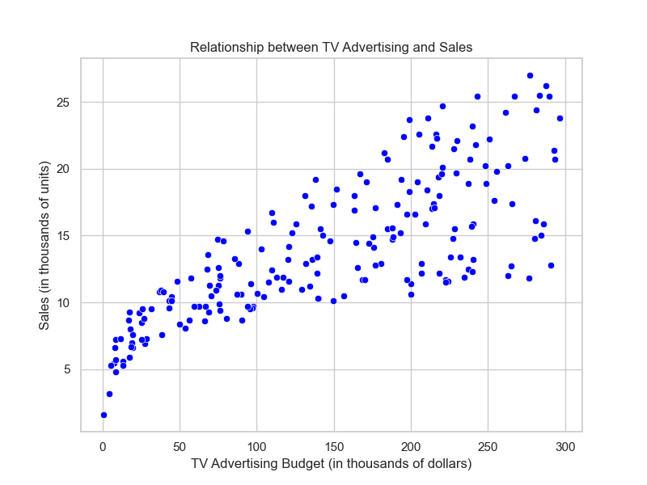
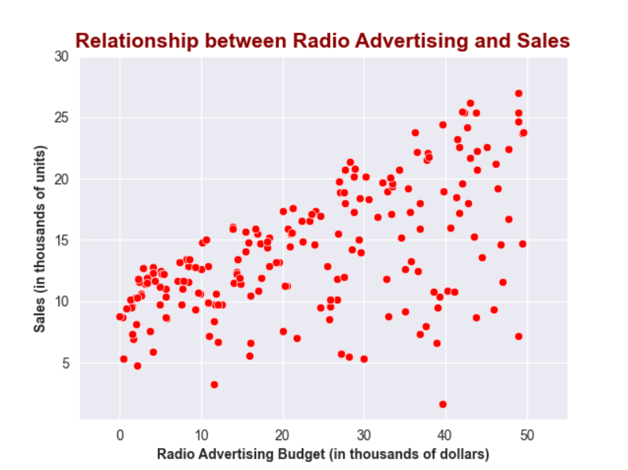
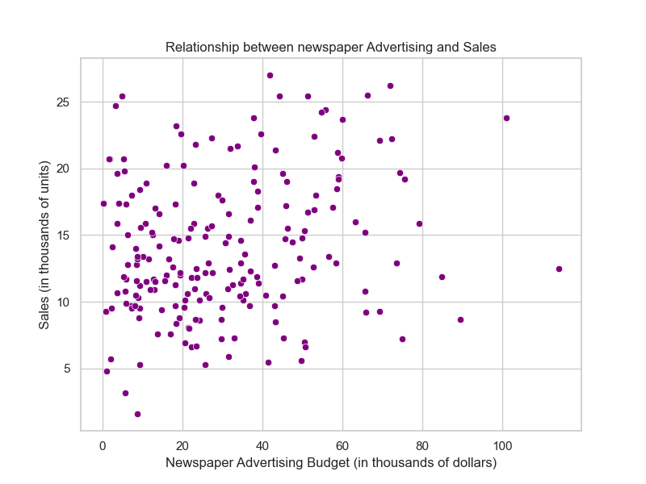
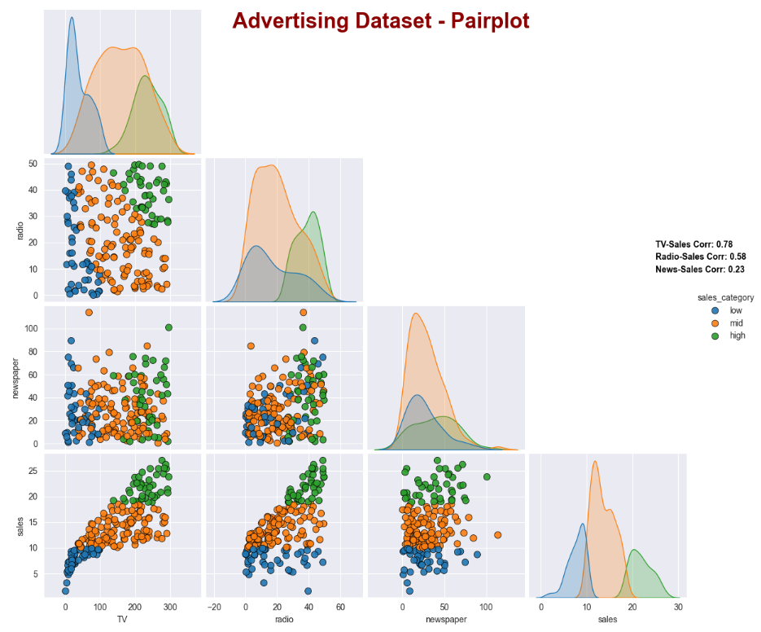
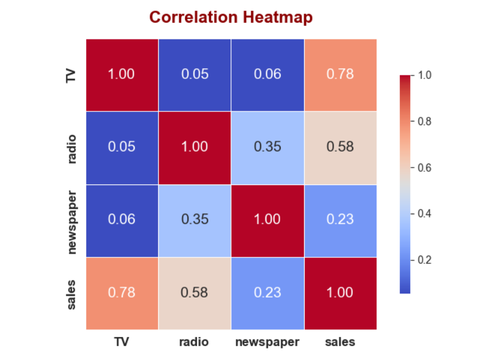
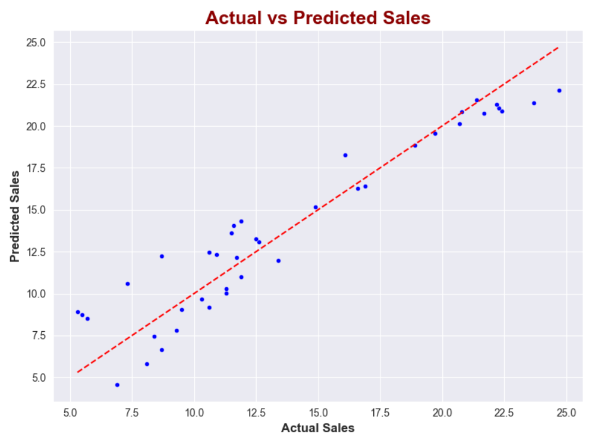
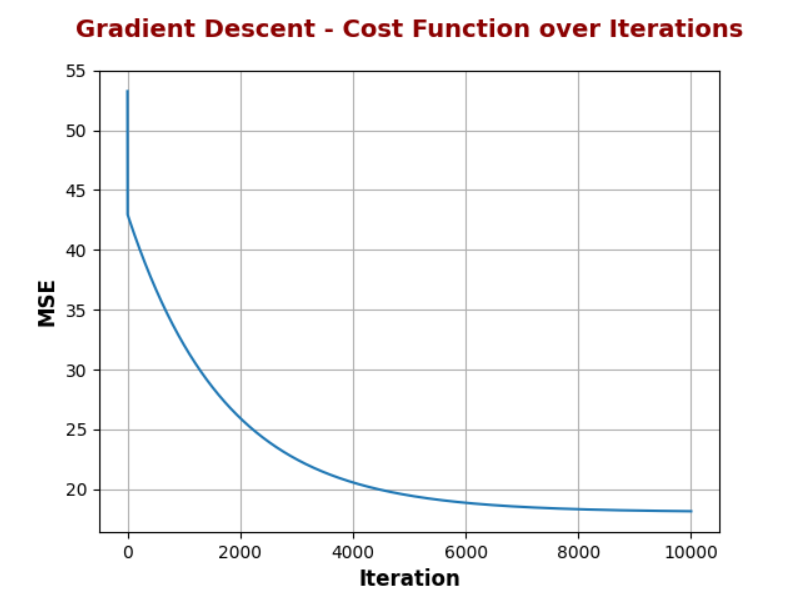
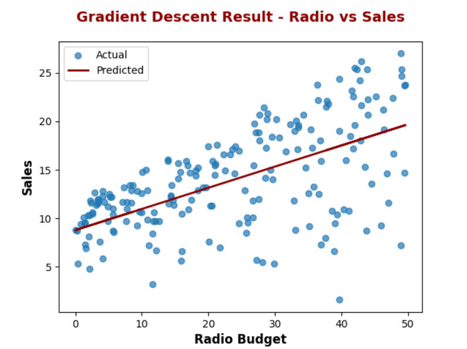

## Advertising Sales Prediction (Linear Regression Demo)

This project demonstrates a basic linear regression analysis using the Advertising dataset from the *An Introduction to Statistical Learning* book.  
It is a demo-level project designed to show how to perform simple and multiple linear regression in Python, visualize key relationships, and evaluate model performance.  
Additionally, it includes an implementation of Gradient Descent from scratch for educational purposes.

---

## 📂 Contents

- 📊 Exploratory Data Analysis  
  - Dataset overview  
  - Scatter plots & correlation matrix  
- 📈 Simple Linear Regression  
  - Model training with `scikit-learn`  
  - Regression line visualization  
- 🧮 Multiple Linear Regression  
  - Evaluation with metrics (MSE, RMSE, MAE, R²)  
  - 10-fold cross-validation  
- ⚙️ Gradient Descent (from scratch)  
  - Cost function  
  - Weight updates  
  - Learning curve visualization

---

## 🛠️ Tools & Libraries

- Python 3.x  
- pandas, numpy  
- matplotlib, seaborn  
- scikit-learn  

---

🚀 Getting Started


1. Clone the repository:

   ```bash
   git clone https://github.com/codelones/advertising-sales-prediction.git
   cd titanic-survival-prediction
   ```

2. Install dependencies:

   ```bash
   pip install -r requirements.txt
   ```

 3. Run the project in PyCharm or any Python IDE.


## 📦 Dataset Source


[Advertising.csv (ISL book)](https://www.statlearning.com/resources-second-edition)


## 📌 Evaluation Metric Selection Warning
⚠️ Important Note on Metric Comparison
It is not appropriate to compare MSE, MAE, and RMSE directly with each other, as they are based on different error formulations and interpret errors in different ways.

Instead, one evaluation metric should be selected before analysis begins, and all comparisons—such as:

- between different models,

- before and after applying feature engineering techniques,

- or during hyperparameter tuning—

should be conducted using that same metric to ensure consistency and fairness in performance evaluation.


## 📊 Visualizations




A scatter plot showing the relationship between TV advertising budget and sales. This visualization helps to analyze how TV advertising affects sales.




A scatter plot displaying the correlation between radio advertising budget and sales. Useful for evaluating the impact of radio ads on product sales.




This plot shows the relationship between newspaper advertising budget and sales. It helps assess how newspaper ads influence sales.




A pairplot illustrating the pairwise relationships between all features in the dataset. It provides a comprehensive view of the data distribution and feature interactions.




A heatmap visualizing the correlation coefficients among all variables. It's essential for detecting multicollinearity before applying multiple linear regression.


This plot visualizes the regression line for a simple linear regression model along with its equation. It demonstrates how the model predicts sales based on TV budget.




A scatter plot comparing actual vs predicted sales values. It visually shows the accuracy and performance of the regression model.



A line plot visualizing the Mean Squared Error (MSE) over each iteration during the gradient descent optimization process.
It demonstrates how the model gradually minimizes the error, indicating convergence towards an optimal solution.



A comparison between the actual sales values and the predicted values generated by the linear regression model trained using gradient descent.
The scatter points represent real data, while the dark red line shows the predicted trend, allowing visual evaluation of the model's fit on the radio feature.

####################################

If you found this helpful, a ⭐ would be appreciated!
